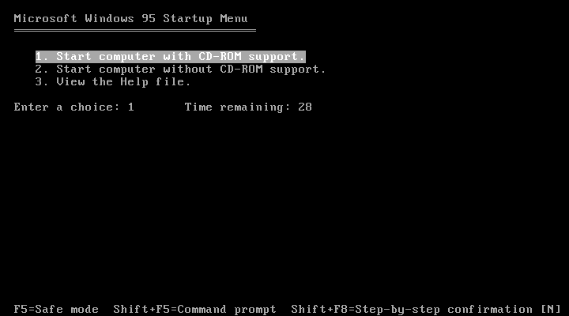

# 95 Windows - Post Export Changes

After every web export, make the following changes to `95_windows.html` before uploading to the server.

---

## 1. Remove the progress bar CSS

Find and **delete** these two CSS blocks:

```css
#status-progress, #status-notice {
	display: none;
}

#status-progress {
	bottom: 10%;
	width: 50%;
	margin: 0 auto;
}
```

Also change `#status` background colour from `#242424` to `#000`:

```css
#status {
	background-color: #000;
	...
}
```

---

## 2. Replace the status div

Find this:

```html
<div id="status">
    
    <progress id="status-progress"></progress>
    <div id="status-notice"></div>
</div>
```

Replace with:

```html
<div id="status">
    
    <div id="status-notice"></div>
</div>
```

---

## 3. Remove progress bar references in the JavaScript

Find the `engine.startGame` call and remove the `onProgress` contents:

```js
engine.startGame({
    'onProgress': function (current, total) {
        // Progress bar removed - loading image shows instead
    },
}).then(() => {
    setStatusMode('hidden');
}, displayFailureNotice);
```

Also remove these two lines inside `setStatusMode`:

```js
statusProgress.style.display = mode === 'progress' ? 'block' : 'none';
```

And delete this line near the top of the IIFE:

```js
const statusProgress = document.getElementById('status-progress');
```

